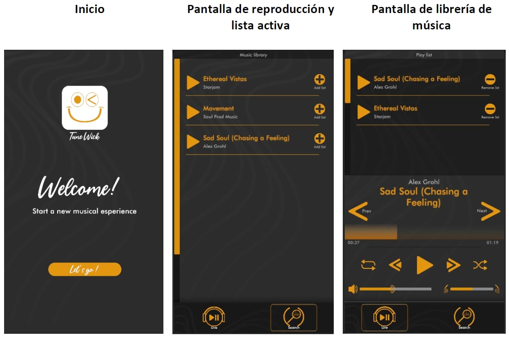

# Desarrollo de Aplicaciones Interactivas - PEC 4
##Music Player

Proyecto universitario de Grado Multimedia en la UOC que consiste en un reproductor de música creado con Unity 2023.1.8f1 para Android.

La aplicación consta de 3 pantallas: 

En primer lugar, es necesario acceder a la librería para añadir canciones al reproductor y poder comenzar la experiencia.

El reproductor consta de las herramientas básicas habituales y muestra la canción activa.

El proyecto contiene de un prefab “songPrefab” con un script personalizado que gestiona los datos y estado de cada canción. Este prefab se instancia por cada canción en el start() a partir de una lista de canciones disponibles.

Por otro lado, existe un GameObject “ManagerMusic” que dispone del Audio Source y un segundo script personalizado “Play List Manager” que se encarga de gestionar la lista de música completa, la lista de reproducción y todo el estado y funcionalidad de los botones.

Descarga el pryecto completo [aquí](https://drive.google.com/file/d/1Fjg9JCCH_1iWeEg7gQip9VY33paTsjs2/view?usp=drive_link).
